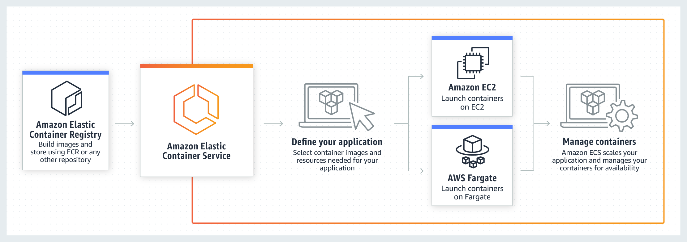

# aws-ecs-elasticstack

`aws-ecs-elasticstack` demonstrates the deployment of a [Dockerized](https://www.docker.com/) [Elastickstack](https://www.elastic.co/elastic-stack) into an [Amazon Elastic Container Service](https://aws.amazon.com/ecs) cluster.

# Overview

This `aws-ecs-elasticstack` project demonstrates the following concepts:

* AWS CLI                                                               
* AWS Cloudformation                                                    
* VPC creation                                                          
* Subnet creation                                                       
* Internet Gateway creation and attach it to the VPC                    
* Route Table creation for internet routing                             
* Route Table association to subnet                                     
* Define the subnet behaviour to auto-assign a public ip to instances   
* Create a KeyPair for EC2 instance access                              
* Create a security group and ingress rule                              
* Create an Autoscaling group                                           
* Create an ASG Launch configuration                                    
* Create an EC2 instance with Security Group                            
* Create an Application Load Balancer                                   
* Create an ECS cluster                                                 
* Create an ECS Service                                                 
* Create ECS task definitions                                           
* Create Cloudwatch log group (awslogs)                                 
* Associate ECS task definitions (target group) with load balancer      
* Cleans up all the resources created 

# AWS ECS

[Amazon Elastic Container Service](https://aws.amazon.com/ecs) (Amazon ECS) allows you to easily run, scale, and secure Docker container applications on AWS. Applications packaged as containers locally will deploy and run in the same way as containers managed by Amazon ECS. Amazon ECS eliminates the need to install, operate, and scale your own container orchestration and cluster management infrastructure, and allows you to focus on the resource needs and availability requirements of your containerized application.



AWS ECS is composed of the following services.


The `aws-ecs-elasticstack` project architecture is reflected in the diagram below (although the launch type is EC2 rather than Fargate).


The auto-generated architecture diagram created by CloudFormation Designer is provided below for reference.


# Elasticstack

The [Elastickstack](https://www.elastic.co/elastic-stack) is composed of Elasticsearch, Kibana, Beats, and Logstash (also known as the ELK Stack). Reliably and securely take data from any source, in any format, then search, analyze, and visualize it in real time.


The `aws-ecs-elasticstack` project deploys a Dockerized version of the Elasticstack into an AWS ECS cluster.

# Deploy the Elasticstack into AWS ECS

## Grab the project 

The first step is to git clone the project.

```bash
git clone --verbose --progress https://github.com/damianmcdonald/aws-ecs-elasticstack aws-ecs-elasticstack
```

## Configure global variables

The second step is to modify any of the ECS cluster variables to suit your needs.

The global variables are defined in the [aws-deploy.sh](aws-deploy.sh) script.

If you just want to have a sandbox environment to experiment with the Elasticstack in AWS ECS then the defaults below are probably fine.

```bash
# Global variable declarations
SLEEP_TIME=15
KEY_PAIR_NAME=MY_KEY_PAIR
IAM_CAPABILITIES=CAPABILITY_IAM
ECS_CLUSTER_STACK_NAME=elasticstack-cluster
ECS_CLUSTER_TEMPLATE=cluster-template.yml
ECS_CLUSTER_INSTANCE_TYPE=c5.4xlarge
ECS_SERVICE_TEMPLATE=service-template.yml
ECS_SERVICE_STACK_NAME=elasticstack-service
UNDEPLOY_FILE=aws-undeploy.sh
```

## Create the AWS ECS cluster and deploy the Elasticstack

Create the AWS ECS cluster and deploy the Elasticstack by executing the [aws-deploy.sh](aws-deploy.sh) script.

```bash
./aws-deploy.sh
```

As part of the execution of the [aws-deploy.sh](aws-deploy.sh) script, one additional file is dynamically created.

Location | Purpose
------------ | -------------
aws-undeploy.sh | Script that can be used to destroy and clean-up all of the resources created by the `aws-ecs-elasticstack` project

## Create beat dashboards in Kibana

Once the [aws-deploy.sh](aws-deploy.sh) script has successfully completed, the script will output various commands that must be executed in order to create the beat dashboards ([Metricbeat](https://www.elastic.co/products/beats/metricbeat), [Filebeat](https://www.elastic.co/products/beats/filebeat) and [Heartbeat](https://www.elastic.co/products/beats/heartbeat)) in [Kibana](https://www.elastic.co/products/kibana).

```bash
*********** METRICBEAT ***********

METRICBEAT_ID=$(docker ps | grep "damianmcdonald/metricbeat-cloud:1.1.0" | awk '"'"'{ print $1 }'"'"');

docker exec -t $METRICBEAT_ID /bin/sh -c "metricbeat --strict.perms=false setup -v"

*********** FILEBEAT ***********

FILEBEAT_ID=$(docker ps | grep "damianmcdonald/filebeat-cloud:1.1.0" | awk '"'"'{ print $1 }'"'"');

docker exec -t $FILEBEAT_ID /bin/sh -c "filebeat --strict.perms=false setup -v"

*********** HEARTBEAT ***********

HEARTBEAT_ID=$(docker ps | grep "damianmcdonald/heartbeat-cloud:1.1.0" | awk '"'"'{ print $1 }'"'"')

docker exec -t $HEARTBEAT_ID /bin/sh -c "heartbeat --strict.perms=false setup -v"
```

## Connect to Kibana
Once the [aws-deploy.sh](aws-deploy.sh) script has successfully completed, the command will out put an `EXTERNAL_URL` that can be used to connect to [Kibana](https://www.elastic.co/products/kibana).


